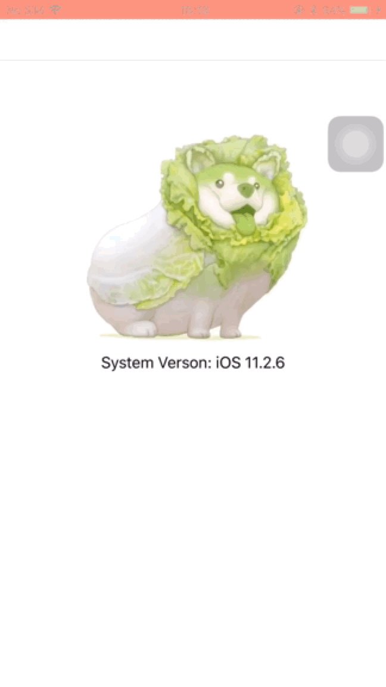
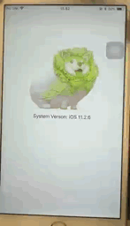

SYPreventScreenshot [中文介绍](https://github.com/SyNvNX/SYPreventScreenshot/blob/main/README_CN.md)
============

A universal library for preventing screenshots and screen recordings, supporting both ImageView and Label.

## Screenshots

<p float="left">
  
	
</p>

The first screenshot actually supports screen recording protection. The effect screenshots has disabled the screen recording prevention feature to display the effect.


## Introduction

This library supports screenshot prevention on iOS 10 and above through DRM (Digital Rights Management) and the preventsCapture feature.

## How to use

* Objective-C

```objective-c
#import <SYPreventScreenshot/SYPreventScreenshot.h>

UIImage *image = [UIImage imageNamed:@"image"];
SYPreventScreenshotImageView *imageView = [[SYPreventScreenshotImageView alloc] initWithImage:image];
[self.view addSubview:imageView];
    
SYPreventScreenshotLabel *label = [[SYPreventScreenshotLabel alloc] initWithText:@"Hello, world!"];
[self.view addSubview:label];
```

* Swift

```swift
import SYPreventScreenshot

let imageView = SYPreventScreenshotImageView(image: UIImage(named: "image"))
view.addSubview(imageView)
    
let label = SYPreventScreenshotLabel(text: "Hello, world!")
view.addSubview(label)
```


## Installation

### CocoaPods

Simply add the following line to your Podfile:

```ruby
pod 'SYPreventScreenshot'
```

Then, run the following command:

```bash
$ pod install
```

## Requirements

- iOS 10.0 or late


## License

SYPreventScreenshot is released under the MIT license. See LICENSE for details.
