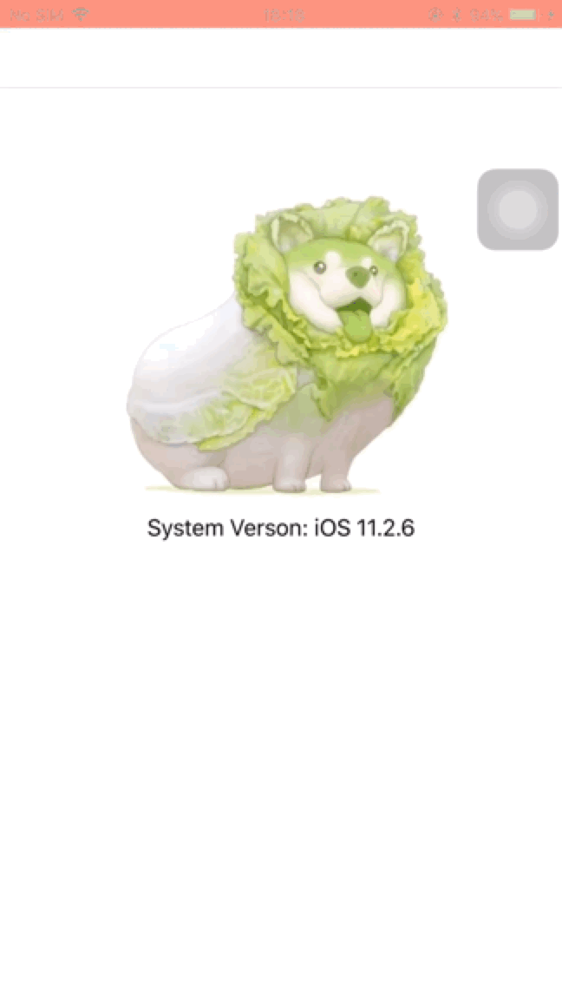

SYPreventScreenshot
============

一个用来防截图和防录屏的通用库，支持 ImageView 和 Label。
## 效果

<p float="left">
  
	
</p>

第一个效果图实际上是支持防录屏，效果图为了展示效果，禁止了防录屏的功能。

## 介绍

本库通过 DRM (Digital Rights Management,数字版权管理) 和 preventsCapture 特性支持了 >= iOS 10 系统的防截图功能。本库的实现没有使用 UITextField 的 secureTextEntry 特性实现防截图，因为其使用到了私有类，在各个系统版本兼容性差，目前已经知道在 iOS 10,11,12,16.7.8,18 等系统版本不支持，在 iOS 15.0.2,16.2 等多个版本存异常问题，可能有更多不同版本有异常，但无法一一验证。

## 如何使用

* Objective-C

```objective-c
#import <SYPreventScreenshot/SYPreventScreenshot.h>

UIImage *image = [UIImage imageNamed:@"image"];
SYPreventScreenshotImageView *imageView = [[SYPreventScreenshotImageView alloc] initWithImage:image];
[self.view addSubview:imageView];
    
SYPreventScreenshotLabel *label = [[SYPreventScreenshotLabel alloc] initWithText:@"Hello, world!"];
[self.view addSubview:label];
```

* Swift

```swift
import SYPreventScreenshot

let imageView = SYPreventScreenshotImageView(image: UIImage(named: "image"))
view.addSubview(imageView)
    
let label = SYPreventScreenshotLabel(text: "Hello, world!")
view.addSubview(label)
```

### SDWebImage

* Objective-C

```objective-c
#import <SYPreventScreenshot/SYPreventScreenshotImageView+WebCache.h>

SYPreventScreenshotImageView *imageView = [[SYPreventScreenshotImageView alloc] initWithImage:nil];
NSURL *URL = [NSURL URLWithString:@"http://www.domain.com/path/to/image.png"];
UIImage *placeholderImage = [UIImage imageNamed:@"image"];
[imageView sy_setImageWithURL:URL placeholderImage:placeholderImage];
```

* Swift

```swift
import SYPreventScreenshot

let imageView = SYPreventScreenshotImageView(image: nil)
let placeholderImage = UIImage(named: "image")
let `URL` = URL(string: "http://www.domain.com/path/to/image.png")
imageView.sy_setImage(with: `URL`, placeholderImage: placeholderImage)
```

## 安装

### CocoaPods

在 `Podfile` 中添加以下代码：

```ruby
pod 'SYPreventScreenshot'

# or 

pod 'SYPreventScreenshot/SDWebImage'
```

然后在终端运行以下命令：

```bash
$ pod install
```

## 基本要求

- iOS 10.0+

## TODO

* Support Swift Package Manager
* Support Carthage
* Support Kingfisher
* Support YYWebImage

## 许可证

SYPreventScreenshot 是基于 MIT 许可证下发布的，详情请参见 LICENSE。
